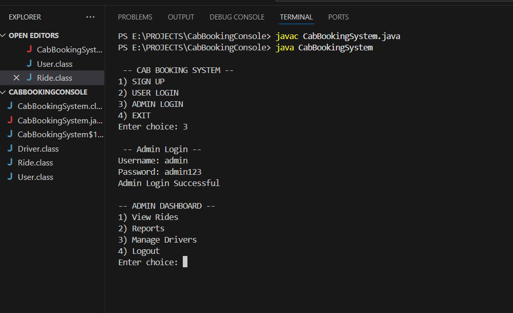
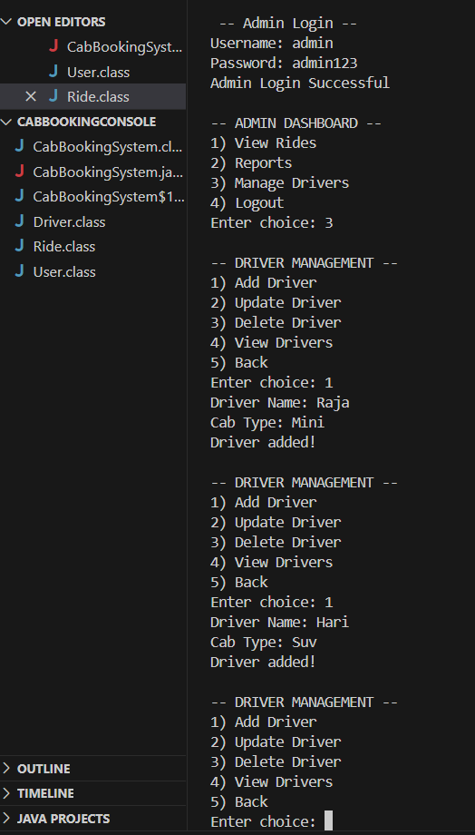
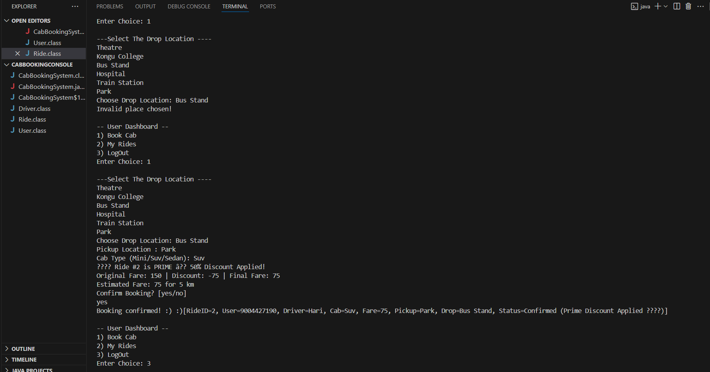

# 🚖 Cab Booking Management System – BYTE RUSH ’25 Hackathon

A console-based Cab Booking Management System developed during the **BYTE RUSH ’25 Hackathon**, focusing on practical features and clear user experience. Proudly secured **🥈 2nd Place** at the event!

---

##  Problem Statement

Develop a console-based Cab Booking Management System with:

- Booking and cancellation of rides  
- Intelligent fare calculation with discounts  
- User ride history tracking  
- Admin functionalities for booking oversight and driver management  

---

##  Features Implemented

-  **User Module**: Registration & login  
-  **Booking System**: Cab booking with availability checks  
-  **Cancellation**: Users can cancel bookings anytime  
-  **Ride History**: Tracking previous rides  
-  **Prime Discount Logic**: 50% off on prime-numbered rides (2, 3, 5…)  
-  **Fare Calculation**: Dynamic fare based on distance × cab type  
-  **Admin Module**: Admin login (`admin / admin123`)  
-  **Dashboard**: View and manage all bookings and drivers  

---

##  Sample Outputs

**Admin Login & Add Driver**, **User Sign-Up**, **Passenger Booking with Prime Discount**  

  
  
  

*(Tip: Combine or organize your screenshots into one or two side-by-side images like above.)*

---

##  Tech Stack

- **Language**: Java  
- **Application Type**: Console-based, no GUI  
- **Preferred IDE**: VS Code (Extension Pack for Java recommended)  

---

##  Future Enhancements

- Support for more cab types (Mini, Sedan, SUV)  
- Dynamic pricing based on demand or surge  
- Integrate a database for ride persistence  
- Add payment gateway integration  
- GUI implementation with JavaFX or Swing  

---

##  Team Members

- **Your Name** ([Shahin Raihaan A](https://github.com/Raihaan29))  
- **Your Friend’s Name** ([Sukkanth Muthukumar](https://github.com/sukkanth))  

---

##  About

A polished console-based cab booking system with key features and innovation wrapped in a simple interface—designed for hackathons and portfolio showcases.

